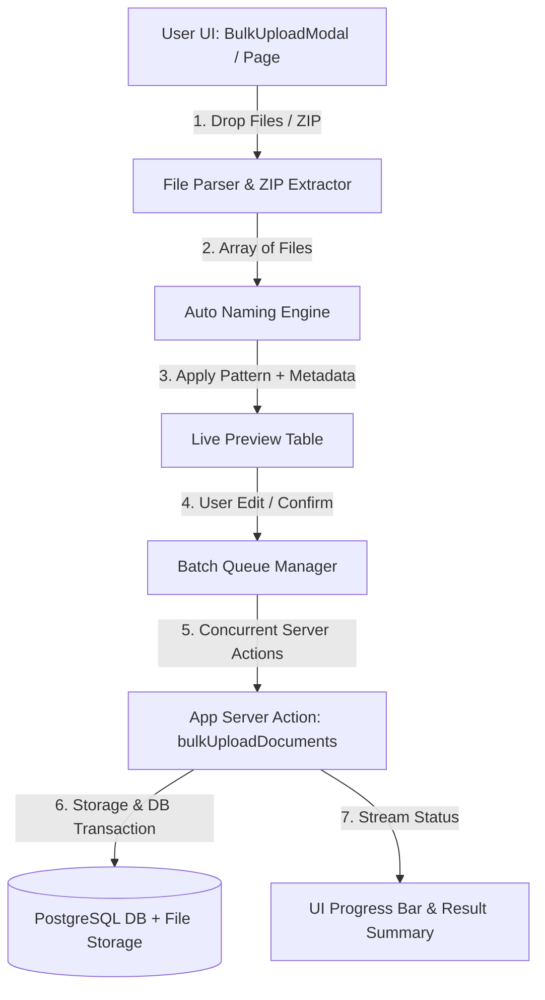
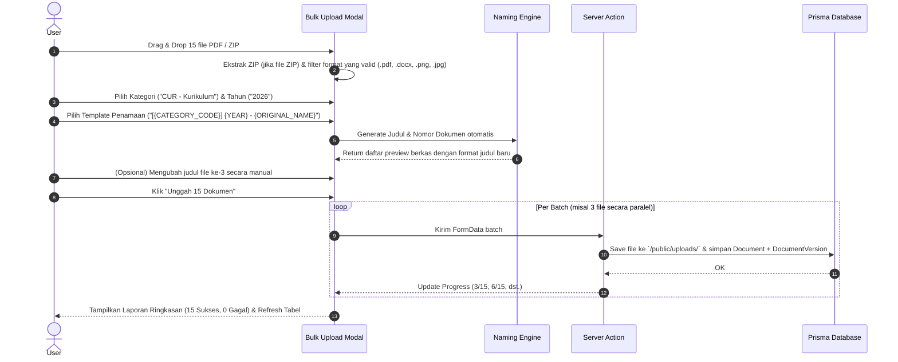
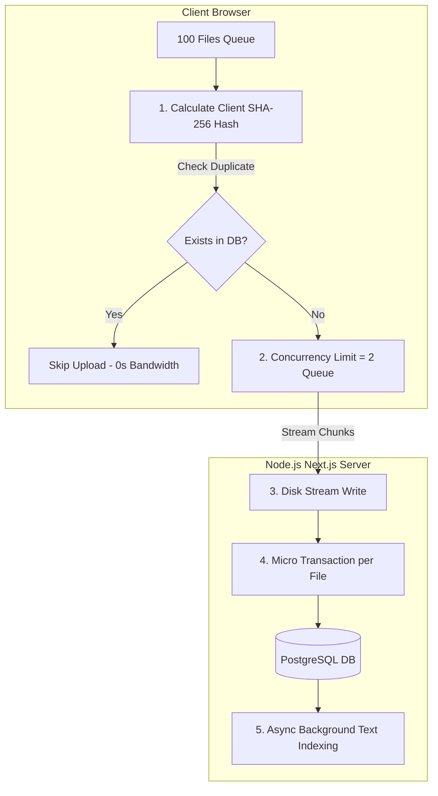

# Rencana Implementasi Fitur Bulk Upload & Formatter Penamaan Otomatis Dokumen

Dokumen ini berisi rencana implementasi teknis untuk membangun **Fitur Bulk Upload Dokumen** beserta **Sistem Penamaan Otomatis (Auto-Naming Convention)** pada aplikasi SIAD-Sekolah (`ares`).

---

## 1. Ringkasan Fitur & Tujuan

### **A. Bulk Upload Dokumen**
- **Unggah Multi-File & ZIP Archive**: Pengguna dapat mengunggah puluhan berkas sekaligus melalui *drag-and-drop* atau mengunggah 1 berkas `.zip` yang otomatis diekstrak oleh sistem.
- **Global Metadata Assignment**: Penetapan nilai default massal (Kategori, Tahun Ajaran, Kerahasiaan, Tags) untuk seluruh antrean berkas, dengan opsi edit manual per item sebelum diunggah.
- **Batch Processing & Progress Tracking**: Pengunggahan diproses secara beruntun (*concurrent batch*) dengan *live progress bar* dan indikator status per file (Pending, Uploading, Success, Error).

### **B. Formatter Penamaan Otomatis (Auto-Naming System)**
- **Dynamic Template Tokens**: Sistem template penamaan dokumen otomatis berbasis variabel/token terstruktur.
- **Real-Time Live Preview**: Judul dokumen dan nomor dokumen langsung berubah secara *real-time* di tabel pratinjau saat pengguna mengubah pola template/metadata.
- **Format Penomoran Standar Sekolah**: Otomatis generate Nomor Dokumen unik sesuai standar instansi (misal: `DOC/CUR/2026/001`).

---

## 2. Token & Preset Format Penamaan Otomatis

### **Daftar Token Variabel:**
| Token | Deskripsi | Contoh Output |
| :--- | :--- | :--- |
| `{CATEGORY_CODE}` | Kode bidang/kategori dokumen | `CUR`, `FIN`, `GOV`, `IT` |
| `{YEAR}` | Tahun Ajaran / Tahun Arsip | `2026`, `2025/2026` |
| `{MONTH}` | Bulan saat upload (2 digit) | `01`, `10` |
| `{DATE}` | Tanggal hari ini (YYYYMMDD) | `20261005` |
| `{INDEX:3}` | Nomor urut antrean (3 digit pad) | `001`, `002`, `003` |
| `{INDEX:4}` | Nomor urut antrean (4 digit pad) | `0001`, `0002` |
| `{ORIGINAL_NAME}` | Nama asli berkas tanpa ekstensi | `Modul_Ajar_Matematika` |

### **Preset Pola Penamaan:**
1. **Standar SIAD (Rekomendasi)**: `[{CATEGORY_CODE}] {YEAR} - {ORIGINAL_NAME} ({INDEX:3})`  
   *Hasil:* `[CUR] 2026 - Modul Ajar Matematika (001)`
2. **Format Surat/Dokumen Resmi**: `DOC/{CATEGORY_CODE}/{YEAR}/{INDEX:3} - {ORIGINAL_NAME}`  
   *Hasil:* `DOC/FIN/2026/001 - Laporan Keuangan`
3. **Preservasi Nama Berkas**: `{ORIGINAL_NAME} - {YEAR}`  
   *Hasil:* `Modul Ajar Matematika - 2026`

---

## 3. Komponen UI & Backend Architecture



### **Rincian Modul & File Baru yang Dibuat:**

1. **`lib/naming-template.ts`** *(Utility Engine)*:
   - Fungsi `applyNamingTemplate(pattern, metadata, fileIndex, originalName)` untuk merender token menjadi judul & nomor dokumen.
   - Fungsi `sanitizeFilename(name)` untuk membersihkan karakter khusus.

2. **`components/dashboard/bulk-upload-modal.tsx`** *(UI Main Modal/Drawer)*:
   - Container utama dialog bulk upload.
   - Integrasi tab pilihan: Upload Multi-File & Upload Archive (ZIP).

3. **`components/dashboard/bulk-file-dropzone.tsx`** *(File Picker)*:
   - Component Drag & Drop berbasis `HTML5 File API`.
   - Mengurus pembacaan berkas ZIP menggunakan `jszip`.

4. **`components/dashboard/bulk-preview-table.tsx`** *(Table & Live Formatter)*:
   - Menampilkan daftar antrean berkas.
   - Kolom: Nama File Asli, Judul Hasil Template, Nomor Dokumen, Ukuran File, Status Validasi, & Action (Remove / Edit).

5. **`app/dashboard/actions/bulk-upload.ts`** *(Server Action)*:
   - Function `bulkUploadDocumentsAction(items: BulkUploadPayload[])`.
   - Menjalankan transaksi Prisma (`db.$transaction`) per berkas atau batch untuk efisiensi & keamanan rollback.

---

## 4. Alur Kerja Pengguna (Step-by-Step User Flow)



---

## 5. Rencana Tahapan Pelaksanaan (Phased Implementation Plan)

### **Fase 1: Dependensi & Core Engine (`lib/naming-template.ts`)**
- [ ] Install package `jszip` (`npm install jszip @types/jszip`) untuk ekstraksi berkas ZIP di client-side.
- [ ] Buat file `lib/naming-template.ts` untuk menangani parsing token:
  ```typescript
  export type NamingTokens = {
    categoryCode: string;
    year: string;
    originalName: string;
    index: number;
    confidentiality: string;
  };
  ```
- [ ] Implementasikan parser regex replacement untuk token `{CATEGORY_CODE}`, `{YEAR}`, `{INDEX:3}`, `{ORIGINAL_NAME}`, dll.

### **Fase 2: Backend Server Action (`app/dashboard/actions/bulk-upload.ts`)**
- [ ] Buat action `bulkUploadSingleDocument` dan `bulkUploadBatchDocuments`.
- [ ] Pastikan validasi RBAC (`assertCategoryAccess`), tipe berkas, dan ukuran berkas (maks 10MB per file).
- [ ] Simpan dokumen ke database dengan relasi `Document` -> `DocumentVersion` dalam transaksi Prisma.
- [ ] Kembalikan respon berstruktur: `{ success: true, docId }` atau `{ success: false, fileName, error }`.

### **Fase 3: Interface & UI Components**
- [ ] Buat `bulk-file-dropzone.tsx` dengan fitur drag-and-drop, penyaringan ekstensi, dan unzipping.
- [ ] Buat form pengatur **Template Penamaan** dengan radio preset & custom input.
- [ ] Buat `bulk-preview-table.tsx` dengan inline editing untuk judul/nomor dokumen jika user ingin penyesuaian khusus.
- [ ] Tambahkan indikator progress upload agregat (`Progress` bar) & itemized status badge.

### **Fase 4: Integrasi & Halaman Dashboard**
- [ ] Tambahkan tombol **"Bulk Upload"** pada Halaman Dashboard Arsip (`app/dashboard/archive/[year]/[category]/page.tsx` dan `app/dashboard/page.tsx`).
- [ ] Hubungkan modal ke revalidation path `revalidatePath(...)` agar tabel dokumen langsung terbarui tanpa refresh halaman.

### **Fase 5: Pengujian & Validasi (Verification)**
- [ ] Uji coba unggah multi-file PDF (10+ file sekaligus).
- [ ] Uji coba unggah file `.zip` berisi dokumen.
- [ ] Uji coba pola template penamaan yang berbeda-beda.
- [ ] Verifikasi penanganan error jika ada 1 file yang corrupt/terlalu besar agar file lain tetap berhasil diunggah (graceful batch handling).

---

## 6. Penanganan Kondisi Khusus (Edge Cases & Validation)

1. **Duplikasi Nama / Nomor Dokumen**:
   - Jika judul hasil template sudah ada di database untuk kategori & tahun yang sama, otomatis tambahkan sufix `(1)`, `(2)`.
2. **File Corrupt / Ekstensi Tidak Valid**:
   - File non-PDF/DOCX/JPG/PNG di dalam folder ZIP akan otomatis difilter dan diberi peringatan pada tabel preview sebelum upload dimulai.
3. **Ketersediaan Memori & Ekstrak Client-side**:
   - Ekstraksi `.zip` dilakukan secara stream di browser menggunakan `jszip` untuk menghindari penumpukan beban di server.

---

## 7. Strategi Pengoptimalan & Pencegahan Server Overload/Down

Untuk mencegah server mengalami *high CPU*, *memory leak*, atau *down* akibat pengunggahan puluhan hingga ratusan dokumen (PDF, DOCX, XLSX, scan) sekaligus, berikut adalah strategi pengoptimalan teknis yang terinspirasi dari arsitektur **Google Drive**:



### **1. Client-Side SHA-256 Hash Check (Pencegahan Duplikat Instan)**
- **Masalah**: Pengguna sering tak sengaja memilih file PDF/DOCX yang sudah pernah diunggah sebelumnya.
- **Solusi**: Sebelum file diunggah, browser menghitung nilai *hash* unik SHA-256 menggunakan `crypto.subtle.digest('SHA-256')`.
- **Hasil**: Browser mengecek hash ke server. Jika file duplikat terdeteksi, upload file tersebut **otomatis dilewati dalam 0.01 detik**, menghemat 100% bandwidth dan storage.

### **2. Client-Side Concurrency Queue (Pembatasan Koneksi Simultan)**
- **Masalah**: Mengirimkan 50-100 request HTTP bersamaan akan menguras koneksi server (`socket starvation`) dan menyebabkan request timeout.
- **Solusi**: Di tingkat browser/UI, gunakan antrean dengan pembatasan konkurensi (**`CONCURRENCY_LIMIT = 2`** atau **`3`**).
- **Cara Kerja**: Hanya 2 atau 3 berkas yang diunggah secara bersamaan. Ketika 1 berkas selesai, berkas berikutnya dalam antrean baru diproses.

### **3. Client-Side ZIP Unzipping via JSZip (Penghematan Beban CPU Server)**
- **Masalah**: Membongkar file ZIP besar (misal 50MB berisi 200 dokumen) di server Node.js memakan *RAM* & *CPU core* secara dramatis.
- **Solusi**: Proses Unzipping dilakukan sepenuhnya di browser client menggunakan `JSZip`.
- **Hasil**: Server hanya menerima file PDF/DOCX individual yang sudah siap simpan secara bertahap dalam antrean ter-throttle.

### **4. Node.js Stream-to-Disk (Minimasi Memori RAM Server)**
- **Masalah**: Penggunaan `Buffer.from(await file.arrayBuffer())` menyimpan seluruh isi file di RAM server sebelum ditulis ke disk.
- **Solusi**: Gunakan Node.js Stream (`Readable.fromWeb(file.stream())` disambungkan ke `fs.createWriteStream()`).
- **Hasil**: Berkas ditulis ke disk per *chunk* kecil (misal 64KB per chunk), sehingga penggunaan RAM server tetap konstan berapapun ukuran filenya.

### **5. Isolasi Transaksi Database (Micro-Transactions)**
- **Masalah**: Membungkus 100 dokumen dalam 1 transaksi Prisma `db.$transaction` rawan *lock timeout* dan jika 1 file gagal, seluruh 99 file ikut terbatal.
- **Solusi**: Jalankan transaksi database **per 1 berkas** (atau per micro-batch 3 file).
- **Hasil**: Jika file ke-15 gagal, 14 file sebelumnya tetap tersimpan dengan aman, dan antrean lanjut ke file ke-16 (*Fault Tolerant*).

### **6. Pemisahan Indexing Teks & OCR (Async Background Task)**
- **Masalah**: Mengekstrak teks PDF/DOCX untuk pencarian (*Full-Text Search*) atau OCR saat upload berlangsung akan memperlambat respon HTTP.
- **Solusi**: Server langsung mengembalikan respon `Sukses` setelah file fisik tersimpan. Ekstraksi teks & pencatatan kata kunci FTS dilakukan secara *asynchronous* (di latar belakang).

### **7. Batas Maksimum Sesi Bulk Upload (Guardrails)**
- **Threshold Limit**:
  - Maksimal berkas per sesi bulk upload: **50 berkas** / batch.
  - Maksimal ukuran per file: **10 MB**.
  - Maksimal total payload batch: **100 MB**.
- Jika user memasukkan file zip berisi 200 berkas, UI akan otomatis memecahnya menjadi beberapa batch atau memberikan petunjuk.

### **8. Roadmap Jangka Panjang (Direct Cloud Upload)**
Jika di kemudian hari jumlah dokumen bertambah ke skala puluhan ribu:
- **Direct-to-S3 / Cloudflare R2 Upload**: Browser mengunggah langsung ke Cloud Storage menggunakan *Presigned URL*, sehingga traffic binary file tidak pernah menyentuh server Node.js sama sekali.
- **Background Worker Queue**: Pengolahan berkas arsip historis dipindahkan ke background queue (seperti BullMQ / Redis worker).

---

> [!NOTE]
> Dengan kombinasi **Client-Side SHA-256 Deduplication** + **Client-Side Concurrency Queue (max 2-3 file)** + **Stream-to-Disk** + **Micro-Transactions**, server aplikasi akan tetap lancar, cepat, dan 100% responsif meskipun pengguna mengunggah puluhan dokumen sekaligus.


