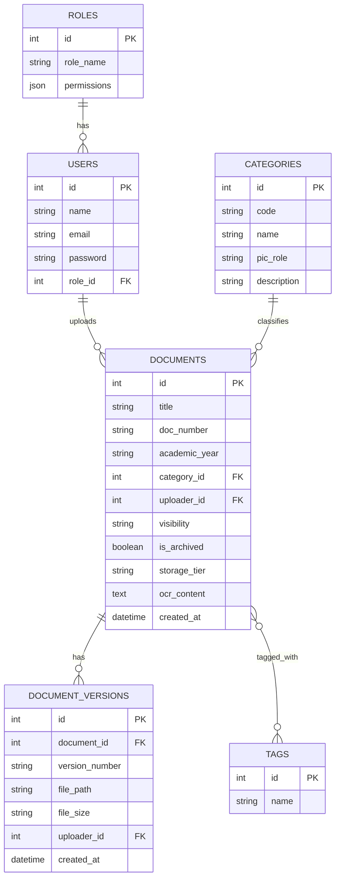

# Product Requirement Document (PRD): Sistem Informasi Arsip Dokumen Sekolah (SIAD-Sekolah)

Dokumen ini mendefinisikan kebutuhan produk untuk pengembangan aplikasi manajemen dan pengarsipan dokumen sekolah. Dokumen ini juga memberikan solusi terperinci untuk tantangan pengelolaan dan backup dokumen historis (tahun-tahun sebelumnya).

---

## 1. Pendahuluan & Latar Belakang

Sekolah menghasilkan ratusan hingga ribuan dokumen setiap tahun ajaran, mulai dari berkas administrasi, kurikulum, data siswa, hingga berkas keuangan. Tanpa sistem digital yang terstruktur, dokumen fisik mudah rusak/hilang, dan pencarian dokumen lama membutuhkan waktu lama. 

Aplikasi **SIAD-Sekolah** dirancang untuk mengamankan, mengorganisasi, dan memudahkan pencarian seluruh dokumen sekolah, baik dokumen aktif maupun dokumen historis (arsip tahun lalu).

---

### 2. Klasifikasi & Penanggung Jawab Dokumen (PIC)

Untuk mempermudah manajemen, pelacakan, dan tanggung jawab data, seluruh dokumen diklasifikasikan ke dalam 10 bidang dengan penanggung jawab masing-masing sebagai berikut:

| Kode | Bidang | Contoh Dokumen | Penanggung Jawab (PIC) |
| :--- | :--- | :--- | :--- |
| **GOV** | Tata Kelola | SOP, Renstra, SK | Direktur / Kepala Sekolah |
| **CUR** | Kurikulum | Modul Ajar, ATP, Kalender Akademik | Wakasek Akademik |
| **STU** | Kesiswaan | Data Siswa, Prestasi, BK | Wakasek Kesiswaan |
| **BRD** | Boarding | Pengasuhan, Perizinan, Tahfiz | Kepala Boarding |
| **HRD** | SDM | Kontrak, KPI, Evaluasi | HR |
| **FIN** | Keuangan | RKAS, SPJ, BOS | Bendahara |
| **OPS** | Operasional | Sarpras, Dapur, Keamanan | Koordinator Operasional |
| **QMS** | Penjaminan Mutu | Audit, AMI, Akreditasi | Tim Penjaminan Mutu |
| **COM** | Humas & Kemitraan | MoU, Media, Alumni | Humas |
| **IT** | Teknologi Informasi | Inventaris, Server, Backup | Tim IT |

---

## 3. Hak Akses (Access Control)

Sistem membatasi hak akses dokumen berdasarkan jabatan untuk menjaga keamanan data:

| Jabatan | Hak Akses Dokumen |
| :--- | :--- |
| **Direktur / Kepala Sekolah** | Semua dokumen (seluruh bidang/klasifikasi) |
| **Wakasek / Kepala Bidang** | Dokumen di bidangnya masing-masing |
| **Guru** | Dokumen pembelajaran (Kurikulum / CUR) |
| **Pembina Asrama** | Dokumen boarding (Boarding / BRD) |
| **TU (Tata Usaha)** | Dokumen administrasi (Tata Kelola / GOV & Operasional / OPS) |
| **Keuangan** | Dokumen keuangan (Keuangan / FIN) |

---

## 4. Manajemen Revisi & Pengarsipan Dokumen Lama

Sistem menerapkan aturan ketat untuk siklus hidup dokumen guna mencegah penggunaan berkas usang:

### A. Aturan Revisi & Versi
1.  **Penomoran Versi:** Semua perubahan/revisi dokumen wajib diberi nomor versi (misal: v1.0, v1.1, v2.0).
2.  **Pembatasan Penggunaan:** Hanya dokumen versi terbaru (Active Version) yang boleh digunakan/diakses secara umum.
3.  **Penanganan Versi Lama:** Versi lama dari dokumen aktif otomatis ditandai dan dipindahkan ke folder **Archive**.

### B. Struktur Folder Penyimpanan
Penyimpanan berkas secara fisik maupun logis dibagi menjadi dua area utama:
*   **Dokumen Aktif:** Disimpan pada folder utama sesuai bidang klasifikasinya (misal: `/kurikulum/`, `/keuangan/`).
*   **Dokumen Lama (Arsip):** Dipindahkan ke folder `/Archive/` yang terstruktur berdasarkan tahun kalender/tahun ajaran:
    ```text
    Archive/
    ├── 2024/
    ├── 2025/
    └── 2026/
    ```

### C. Solusi Backup & Pengarsipan Massal (Historical Archive)
*   **Bulk Import & Auto-Mapping:** Admin dapat mengunggah berkas arsip masa lalu dalam format ZIP. Sistem akan mengekstrak dan memetakan dokumen ke folder tahun arsip yang sesuai secara otomatis berdasarkan nama folder ZIP.
*   **Tiered Storage:** Dokumen di dalam folder `Archive` yang berumur lebih dari 2 tahun akan otomatis dipindahkan ke *Cold Storage* (misal: AWS S3 Glacier / Cloudflare R2) untuk menghemat biaya operasional, sementara metadatanya tetap dapat dicari di aplikasi.
*   **OCR untuk Dokumen Scan:** Dokumen fisik lama yang di-scan akan diproses dengan engine OCR agar teksnya terindeks dan dapat dicari melalui fitur pencarian.

---

## 5. Fitur Utama Aplikasi

### 5.1. Manajemen Dokumen & Metadata
*   **Upload Dokumen:** Mendukung format PDF, DOCX, XLSX, PPTX, JPG, PNG.
*   **Form Metadata:** Saat upload, user wajib mengisi:
    *   Judul Dokumen
    *   Nomor Surat / Dokumen (Opsional)
    *   Kategori/Bidang (Memilih dari 10 kode klasifikasi)
    *   Tahun Ajaran / Tahun Kalender
    *   Deskripsi / Ringkasan singkat
    *   Tags (Kata kunci pemudah pencarian)
    *   Tingkat Kerahasiaan (Publik, Internal Staff, Rahasia/Keuangan)

### 5.2. Pencarian & Filter Canggih (Search Engine)
*   **Pencarian Cepat:** Pencarian global berbasis judul, nomor surat, tags, deskripsi, dan isi teks dokumen (Full-Text Search).
*   **Filter Panel:** Berdasarkan Bidang (Kode), Tahun Ajaran, Pengunggah, dan Tanggal Upload.

### 5.3. Evaluasi Berkala Manajemen Dokumen
Manajemen dokumen wajib dievaluasi **minimal 1 kali setiap semester** untuk memastikan:
*   Dokumen yang tersimpan masih berlaku/valid.
*   Tidak ada duplikasi dokumen di dalam sistem.
*   Seluruh staf menggunakan dokumen versi terbaru.

---

## 6. Rancangan Arsitektur Teknologi (Rekomendasi)

*   **Backend:** Node.js (NestJS / Express) atau Laravel (PHP). Laravel sangat direkomendasikan jika sekolah menginginkan deployment cepat di shared hosting atau VPS terjangkau.
*   **Frontend:** React.js dengan Vite, atau Next.js untuk performa yang optimal.
*   **Database:** PostgreSQL (memiliki performa *Full-Text Search* bawaan yang sangat baik).
*   **Penyimpanan File:** Supabase Storage / AWS S3 / Cloudflare R2 dengan siklus pemindahan otomatis ke Glacier.

---

## 7. Draft Skema Database (Penting)

Berikut adalah relasi tabel dasar untuk mendukung fitur-fitur di atas:



---

## 8. Rencana Rilis & Implementasi (Roadmap)

### **Fase 1: Minimum Viable Product (MVP) - Bulan 1-2**
*   Login, Manajemen Role, & Hak Akses Jabatan.
*   Upload Dokumen aktif & pengisian Metadata dasar sesuai 10 bidang klasifikasi.
*   Pencarian teks sederhana (Judul & Kategori).
*   Download & View dokumen langsung di browser.

### **Fase 2: Manajemen Arsip Historis & Revisi - Bulan 3**
*   Fitur Bulk Import (ZIP upload) untuk dokumen lama ke folder `Archive/[Tahun]`.
*   Sistem Versioning Dokumen dan pemindahan otomatis versi lama ke Archive.
*   Penerapan fitur Read-Only untuk arsip tahun lalu.
*   Pencarian Full-Text (isi dokumen).

### **Fase 3: Optimasi, Backup & Evaluasi - Bulan 4**
*   Integrasi Cold Storage untuk berkas > 2 tahun.
*   Fitur Auto-backup database & file sistem secara berkala.
*   Implementasi OCR untuk dokumen hasil scan.
*   Dashboard monitoring untuk Evaluasi Semesteran (laporan duplikasi & validitas dokumen).
